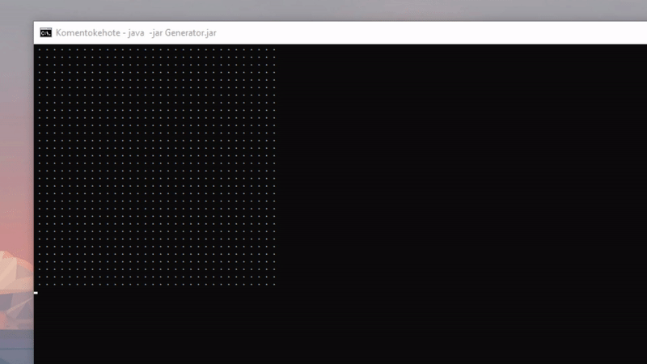

# ASCII-Image-Generator
 ### Kotlin commandline application for generating ASCII images/animations from local files
 
 
 
 ## Usage
 ASCII Image Generator creates ASCII versions of pictures and gifs from your local machine and outputs the results
 to the terminal. Using the application locally you need to have at least JDK installed on your computer, Kotlin Compiler 
 installation is recommended to make compiling the executable .jar file convenient. Alternatively you can use the compiler of
 your IDE that supports Java/Kotlin (IntelliJ e.g.).
 
 #### Compiling Generator.jar
 
 The project repository contains compiled Generator.jar in root\src\main\kotlin, but in case you want to play around
 with the code and configuration you can always compile your own .jar after making changes.
 To compile an executable .jar file, run the following command while in root\src\main\kotlin:
 ```
 kotlinc Generator.kt Frame.kt AsciiAnimation.kt -include-runtime -d Generator.jar
 ```
 
 #### Running the Generator.jar
 
 To run the compiled application on the commandline, use the following command while in the folder where the .jar is located:
 ```
 java -jar Generator.jar
 ```
 
 ## Generating ASCII-image
 When the Generator.jar is executed, the user will first be asked to enter path into the location of the image they want to convert
 into ASCII-art. Generator accepts the most common image types (png, jpg etc.).
 ```
 Enter path:C:\Your\Local\Path\picture.jpg
 ```
 
 After giving the path the user can configure the maximum height in pixels of the outputted ASCII-image.
 ```
 Set max height (px) of the rendered image/animation:64
 ```
 
 There are no given restrictions on how large the resolution images can be converted to ASCII-art. However, the terminal as a platform can be restricting, which means
 the bigger the picture will be, the more configuring on your terminal you'll have to do to actually view the image. It is recommended to keep the max height between
 32-128 pixels. On Windows, you can configure the terminal size from the terminal settings to be larger and zoom out with CTRL+mousewheel to view larger outputted ASCII-images.
 The application will provide the following information before printing the  final output into the terminal:
 ```
 Width:1916px | Height:1078px  // The original size of the image
 
 // The last two will only be outputted if the image is too big and has to be scaled down to match size requirements
 
 Scale ratio:13.475  // The ratio for how many times smaller the image is scaled down. Formula: originalHeight/maxHeight
 Scale complete. Width:142px | Height:80px  // The final size of the scaled down image
 ```
 
 ### Examples
 
 #### Cyberpunk logo - maxHeight:50px
 
 
 
 #### Yakuza Kiryu - maxHeight: 32px / 64px / 128px
 
 
 
 
 ## Generating ASCII-animation (Proof of Concept/Experimental)
 Generating an animation is no different than creating an image. The generator recognizes files with .gif file extension and will create and play
 an animation instead of presenting a static picture.
 
 ### General information and current state
 The animation creation is more of a proof of concept than an actually usable feature at its current state. The biggest restricting factor is the Windows terminal,
 which makes it hard to render and refresh created ASCII-frames efficiently, since it uses very limited amount of resources of the system and can't keep up with the
 constant printing of multidimensional arrays. 
 
 From briefly playing around with different command prompt configurations, the biggest factor that affects the smoothness of 
 the animation, slows down the frame refresh rate and increases flickering is the size of both horizontal and vertical screen buffers. It seems the more lines and 
 charachters the terminal has to buffer every refresh cycle, the more resources it uses from its already small reserve, which leads to slower execution.
 
 At its current state, it's recommended to keep the gif maxHeight small at around 32px to get tolerable viewing experience with decent refresh rates. The refresh rates can 
 be configured manually within the AsciiAnimation -class in milliseconds, but the final refresh rate when running the animation in terminal is highly dependent on the resolution
 of the ASCII-animation (larger resolution -> slower refresh rate).
 
 #### ArrayIndexOutOfBoundsException: 4096
 While trying to read some .gif files the application will throw ArrayIndexOutOfBoundsException: 4096. This is a well known bug in the GIFImageReader class of the Java runtime,
 which for some reason hasn't been patched to this date. The error only occurs while trying to read some specific .gif files, but it's unkown for the moment why some .gifs
 result in throwing the error. See the links below for some more information and discussion about the issue:
 
 * [Stackoverflow: ArrayIndexOutOfBoundsException: 4096 while reading gif files](https://stackoverflow.com/questions/22259714/arrayindexoutofboundsexception-4096-while-reading-gif-file)
 * [Related bug report on ArrayIndexOutOfBoundsException: 4096](https://bugs.openjdk.java.net/browse/JDK-7132728)
 
 ### Example
 #### Sphere - maxHeight:32 px - refreshRate: 32ms
 
 ##### Original:
 
